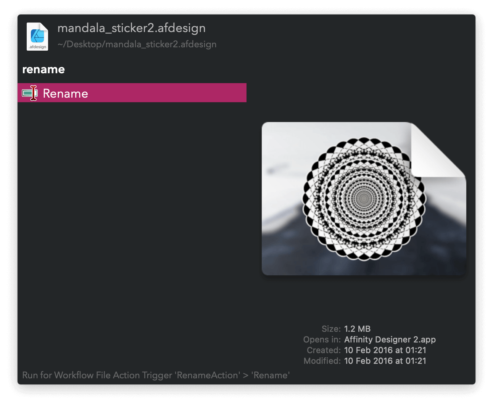

#  Rename Action Alfred Workflow

Rename files and folders

<a href='https://alfred.app/workflows/vitor/rename-action'>⤓ Install on the Alfred Gallery</a>

## Usage

Rename a file or folder via the [Universal Action](https://www.alfredapp.com/help/features/universal-actions/).

Press <kbd>⌘</kbd><kbd>↩&#xFE0E;</kbd> at any state to reopen the Universal Actions panel after renaming.
